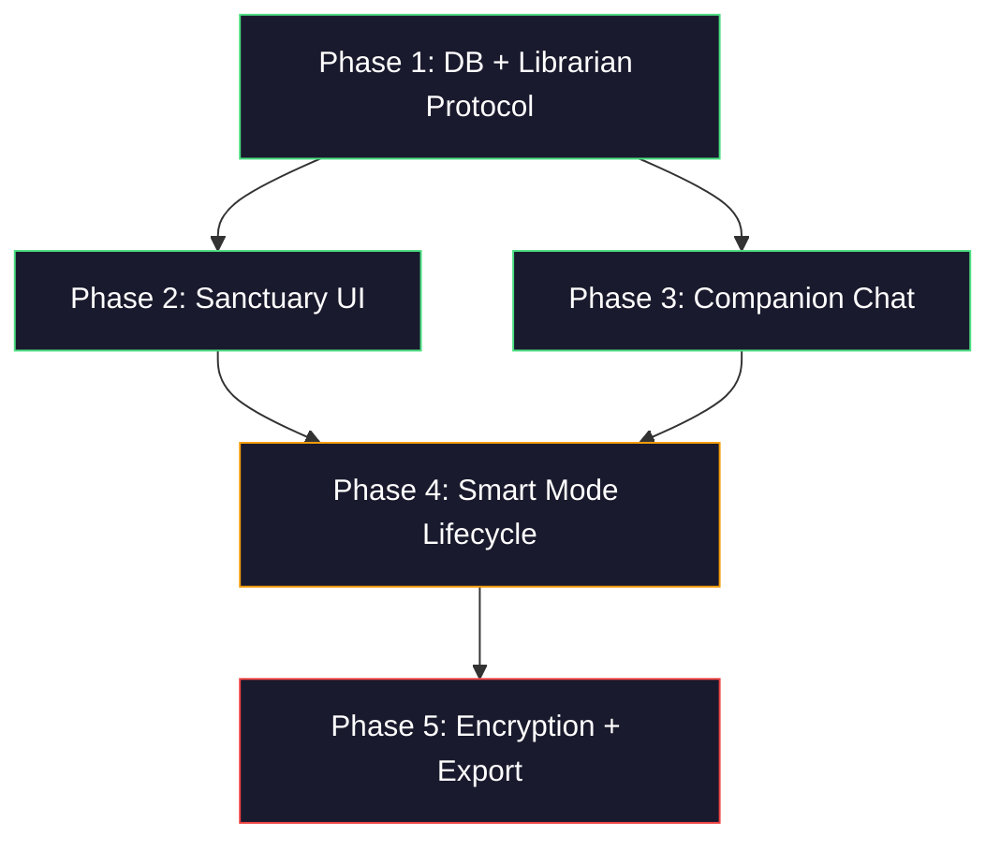

# The Sanctuary — Implementation Plan

> Bridging what exists today to the full vision described in [README.md](file:///e:/Reflections/docs/sanctuary/README.md), [AGENTS.md](file:///e:/Reflections/docs/sanctuary/AGENTS.md), and [SYSTEM_DESIGN.md](file:///e:/Reflections/docs/sanctuary/SYSTEM_DESIGN.md).

---

## Current State — Gap Analysis

### What Already Exists ✅

| Feature | Where | Notes |
|:---|:---|:---|
| **Life Themes / Wiki Pages** | [wikiService.ts](file:///e:/Reflections/services/wikiService.ts), [wikiTypes.ts](file:///e:/Reflections/services/wikiTypes.ts) | CRUD for freeform themes + 4 structured pages (`mood_patterns`, `recurring_themes`, `self_model`, `timeline`) plus an `index` |
| **AI Ingest Pipeline** | [aiService.ts](file:///e:/Reflections/services/aiService.ts) → [api/ai.ts](file:///e:/Reflections/api/ai.ts) | `processNoteIntoWiki` (decide → synthesize → cite) and `refreshWikiOnDemand` (bulk rebuild from themes or notes) |
| **Theme Citations** | `theme_citations` table + [wikiService.getThemeSources](file:///e:/Reflections/services/wikiService.ts#L231) | Many-to-many Note ↔ Theme links |
| **Free-tier Gating** | [wellnessPolicy.ts](file:///e:/Reflections/services/wellnessPolicy.ts) | 30 notes/month, 1 free wiki refresh, 1 free AI reflection |
| **Insights UI** | [Insights.tsx](file:///e:/Reflections/pages/dashboard/Insights.tsx) | Rhythm stats, mood frequency, tag cloud, theme cards with detail sheet |
| **Ambient Audio** | [useAmbientAudio.ts](file:///e:/Reflections/hooks/useAmbientAudio.ts), [audioEngine.ts](file:///e:/Reflections/services/audioEngine.ts), [AmbientPlayer.tsx](file:///e:/Reflections/components/wellness/AmbientPlayer.tsx) | 4 bundled .ogg tracks with fade transitions via Web Audio API |
| **Static Wellness Prompts** | [wellnessPrompts.ts](file:///e:/Reflections/services/wellnessPrompts.ts) | 7 curated prompts, context-agnostic |
| **AI Contextual Prompts** | `handlePrompts` in [api/ai.ts](file:///e:/Reflections/api/ai.ts#L126) | Personalized journaling prompts from recent entries (already wired as API action) |
| **Database Schema** | [supabase_schema.sql](file:///e:/Reflections/supabase_schema.sql) | `profiles`, `notes`, `life_themes`, `theme_citations`, storage policies, triggers |

### What Is Partially Built 🟡

| Feature | Current State | Gap |
|:---|:---|:---|
| **Taxonomy (People, Patterns, Philosophies, Eras, Decisions)** | Wiki pages exist as 4 flat types (`mood_patterns`, `recurring_themes`, `self_model`, `timeline`) | AGENTS.md defines 5 categories: People, Patterns, Philosophies, Eras, Decisions. Current types are a different classification. Need to either remap or add the 5 AGENTS.md categories alongside |
| **Auto-Ingest on Save** | `processNoteIntoWiki` exists but is **never called** from CreateNote.tsx — there's even a [contract test explicitly banning it](file:///e:/Reflections/components/ui/productContractPhase1.test.ts#L13) | SYSTEM_DESIGN says "Incremental Absorb: Real-time synthesis triggered by every Save event" |
| **Wiki Index page** | `_rebuildIndex` writes an `index` page after ingest | Not surfaced in the Sanctuary UI as a navigation hub |
| **AI-Generated Prompts** | API handler exists (`handlePrompts`) | Not wired as "Contextual Sparks" that reach back into Wiki content |

### What Is Completely Missing 🔴

| Feature | Design Doc Reference |
|:---|:---|
| **`wiki_links` table** (many-to-many article interlinking) | SYSTEM_DESIGN §3.2 |
| **`wiki_absorb_log` table** (contribution hash per note) | SYSTEM_DESIGN §3.2 |
| **Wikilinks `[[Page Title]]` parsing & rendering** | AGENTS.md §1.5 |
| **The Companion (chat interface)** | SYSTEM_DESIGN §1.2, README Feature Matrix |
| **PBKDF2 Client-Side Encryption** | SYSTEM_DESIGN §2.1 — full Zero-Trust protocol |
| **Obsidian Vault Export** | README Feature Matrix |
| **Smart Mode Opt-In / Opt-Out lifecycle** | SYSTEM_DESIGN §4 |
| **The Great Ingest** (background batch processing of historical corpus) | SYSTEM_DESIGN §1.2 |
| **Re-Absorb on note edit** (conflict resolution) | SYSTEM_DESIGN §5, AGENTS.md §2.1 |
| **Read-Before-Write discipline** (agent reads full wiki page state before updating) | AGENTS.md §1.3 |
| **Bloat Control** (auto-splitting pages > 120 lines) | AGENTS.md §4 |
| **Contradiction Detection / Annotation** | AGENTS.md §4 |
| **Source citations in UI** (verifiable `[Source: id]` rendering) | SYSTEM_DESIGN §5, AGENTS.md §3 |
| **Sanctuary dedicated route / page** | README §1 — The Sanctuary is described as a distinct destination, not just the Insights page |
| **Locked category placeholders for free tier** | SYSTEM_DESIGN §1.1 — categories visible but articles locked |
| **Ambient music streaming API** (premium tier) | README Feature Matrix — currently uses bundled local .ogg files, not a streaming API |

---

## Open Questions

> [!IMPORTANT]
> These decisions will shape the implementation significantly. Please weigh in before I proceed.

1. **Taxonomy Strategy**: The current wiki pages use `mood_patterns`, `recurring_themes`, `self_model`, `timeline`. AGENTS.md specifies `People`, `Patterns`, `Philosophies`, `Eras`, `Decisions`. Should we:
   - **(A)** Replace the current 4 types with the 5 AGENTS.md categories (breaking change for existing wiki data)?
   - **(B)** Keep the current 4 as "system-generated summaries" and add the 5 AGENTS.md categories as a new layer of user-facing Sanctuary articles?
   - **(C)** Hybrid — map `mood_patterns` → Patterns, `self_model` → Philosophies, `timeline` → Eras, and add People + Decisions as new?

2. **Auto-Ingest on Save**: The contract test at [productContractPhase1.test.ts:13](file:///e:/Reflections/components/ui/productContractPhase1.test.ts#L13) explicitly forbids calling `processNoteIntoWiki` from CreateNote. Was this intentional (to keep ingest always user-initiated) or is it a placeholder constraint that should be removed for Smart Mode?

3. **Encryption Scope**: PBKDF2 encryption is a substantial architectural change (client-side key derivation, transient tokens, Edge Function decryption). Should we:
   - **(A)** Implement it now as part of the Sanctuary rollout?
   - **(B)** Defer it to a dedicated security sprint and focus on features first?

4. **LLM Provider**: The current backend uses `@google/genai` (Gemini). SYSTEM_DESIGN mentions "Google Vertex AI." Should we stay on consumer Gemini API or move to Vertex AI for the non-training guarantee?

5. **Companion Chat UX**: Should the Companion be:
   - **(A)** A dedicated `/sanctuary/chat` page?
   - **(B)** A slide-out panel accessible from the Sanctuary page?
   - **(C)** A floating widget available globally?

6. **Monetization Timeline**: The Free vs Smart Mode split drives the gating logic. Is the Stripe/payment integration already planned or should this plan stub it out?

---

## Proposed Changes — Phased Roadmap

### Phase 1: Database Foundation & Librarian Protocol
*Estimated: Backend-heavy, no visible UI changes yet*

> [!NOTE]
> This phase makes the backend capable of the full Sanctuary vision without changing anything the user sees.

---

#### Database Schema

##### [NEW] Migration: `wiki_links` and `wiki_absorb_log` tables

```sql
-- wiki_links: Many-to-many interlinking between wiki articles
create table if not exists wiki_links (
  id uuid default gen_random_uuid() primary key,
  source_page_id uuid references life_themes(id) on delete cascade not null,
  target_page_id uuid references life_themes(id) on delete cascade not null,
  created_at timestamptz default now() not null,
  unique(source_page_id, target_page_id)
);

-- wiki_absorb_log: Tracks which notes have been ingested and their content hash
create table if not exists wiki_absorb_log (
  id uuid default gen_random_uuid() primary key,
  user_id uuid references auth.users(id) on delete cascade not null,
  note_id uuid references notes(id) on delete cascade not null,
  content_hash text not null,
  absorbed_at timestamptz default now() not null,
  unique(user_id, note_id)
);
```

##### [MODIFY] `life_themes` table — Extend `page_type` enum

Add the 5 AGENTS.md taxonomy categories to the `page_type` check constraint (pending decision on Question 1):
- `people`, `patterns`, `philosophies`, `eras`, `decisions`

---

#### Librarian Agent Protocol

##### [MODIFY] [aiService.ts](file:///e:/Reflections/services/aiService.ts)
- **Read-Before-Write**: Before updating any wiki page, fetch and inject the full current content into the LLM prompt (AGENTS.md §1.3). The current `handleIngestSynthesis` partially does this but needs to be enforced in all paths.
- **Absorb Log**: After successful ingest, compute a SHA-256 hash of the note content and upsert into `wiki_absorb_log`. On re-save, compare hashes to detect edits and trigger Re-Absorb.
- **Wikilink Extraction**: After synthesis, parse `[[Page Title]]` patterns from generated content and populate `wiki_links`.

##### [MODIFY] [api/ai.ts](file:///e:/Reflections/api/ai.ts)
- Update `handleIngestSynthesis` prompt to enforce the "Steve Jobs Test" encyclopedic tone (AGENTS.md §1.4).
- Add `handleCompanionQuery` action for Phase 3.
- Add strict citation format: every claim must end with `[Source: note_id]`.

##### [NEW] `services/wikiLinksService.ts`
- `extractAndSaveLinks(pageId, content)`: Parse `[[...]]` from content, resolve to page IDs, upsert into `wiki_links`.
- `getBacklinks(pageId)`: Fetch all pages that link to a given page.
- `getOutlinks(pageId)`: Fetch all pages a given page links to.

##### [NEW] `services/absorbLogService.ts`
- `hasBeenAbsorbed(noteId)`: Check if a note has been ingested.
- `getContentHash(noteId)`: Get the stored hash.
- `logAbsorption(noteId, contentHash)`: Record an absorption event.
- `needsReAbsorb(noteId, currentContent)`: Compare stored hash with current content.

##### [MODIFY] [wikiTypes.ts](file:///e:/Reflections/services/wikiTypes.ts)
- Add new `WikiPageType` values for the AGENTS.md taxonomy.

---

### Phase 2: Sanctuary UI — The Dedicated Page
*Estimated: UI-heavy, leveraging existing component library*

---

##### [NEW] Route: `/sanctuary`

Add `SANCTUARY = '/sanctuary'` to [RoutePath](file:///e:/Reflections/types.ts#L100) enum, register in [App.tsx](file:///e:/Reflections/App.tsx).

##### [NEW] `pages/dashboard/Sanctuary.tsx`

The main Sanctuary page, structured as a library:
- **Header**: "The Sanctuary" with subtitle "Your life, synthesized"
- **Category Grid**: 5 cards for People, Patterns, Philosophies, Eras, Decisions
  - Free tier: cards visible but articles show "Locked" overlay
  - Smart Mode: cards expand into the article list
- **Wiki Index**: Surface the index page as a navigable overview
- **Freeform Themes**: Continue showing user-created themes below the categories
- **Entry point to Companion Chat** (Phase 3)

##### [NEW] `pages/dashboard/SanctuaryArticle.tsx`

Full-page article view:
- Renders wiki content as Markdown with `[[wikilink]]` resolution
- Shows source citations as clickable references back to the original notes
- Shows backlinks at the bottom ("Pages that reference this article")
- Last-updated timestamp

##### [MODIFY] [Insights.tsx](file:///e:/Reflections/pages/dashboard/Insights.tsx)

- Keep the existing rhythm stats (this is the "Mirror" free-tier experience)
- Replace the "Life themes" section with a CTA card linking to `/sanctuary`
- Remove the inline theme cards and theme detail ModalSheet (moved to Sanctuary)

##### [NEW] `components/ui/WikilinkRenderer.tsx`

A component that:
- Parses `[[Page Title]]` in wiki content
- Renders them as styled internal links to `/sanctuary/article/:id`
- Handles broken links gracefully (dimmed, non-clickable)

##### [NEW] `components/ui/CitationBadge.tsx`

Renders `[Source: note_id]` references as small clickable badges that navigate to the source note.

---

### Phase 3: The Companion (Chat Interface)
*Estimated: Medium complexity — new UI + new API action*

---

##### [NEW] `pages/dashboard/Companion.tsx` or panel component

A chat interface grounded exclusively in wiki content:
- User asks a question → system fetches relevant wiki pages → LLM answers with citations
- Conversation history stored in session (not persisted to DB initially)
- Visual design: minimal, conversational, one-column

##### [NEW] API action: `companionQuery` in [api/ai.ts](file:///e:/Reflections/api/ai.ts)

```
handleCompanionQuery(payload):
  1. Fetch all wiki_pages for this user
  2. Build context from wiki content
  3. Answer with citations: "You first mentioned this theme in [[Theme: Creative Burnout]]"
  4. Grounding rule: ZERO external knowledge, ONLY wiki content
```

##### [MODIFY] [aiClient.ts](file:///e:/Reflections/services/aiClient.ts)
- Add `'companionQuery'` to `AiAction` type.

---

### Phase 4: Smart Mode Lifecycle & Incremental Ingest
*Estimated: High complexity — opt-in flow, background processing*

---

##### [NEW] Smart Mode Opt-In Flow

- Toggle in Account or Insights page: "Enable Smart Mode"
- On toggle: show explanation modal → confirm → enable
- Profile column: `smart_mode_enabled boolean default false`

##### [NEW] The Great Ingest (Background Batch Processing)

When Smart Mode is first enabled:
1. Fetch all existing notes
2. Process in batches of 5 (to avoid token limits)
3. For each batch: run the Absorb workflow
4. Show progress indicator ("Processing entry 12 of 47...")
5. Populate `wiki_absorb_log` for each processed note

##### [MODIFY] `CreateNote.tsx` — Auto-Ingest on Save (Smart Mode only)

For Smart Mode users:
- After a note is saved, fire `processNoteIntoWiki` in the background (non-blocking)
- Compare content hash to detect edits → trigger Re-Absorb
- Remove/gate the existing contract test constraint

##### [NEW] Opt-Out / "Nuclear Option"

- "Delete Sanctuary Data" button on Account page
- Purges: `wiki_pages` (life_themes where page_type != 'theme'), `wiki_links`, `wiki_absorb_log`
- Returns user to Free Tier
- Raw notes preserved

---

### Phase 5: Encryption, Export & Premium Features
*Estimated: Highest complexity — crypto, data portability*

> [!WARNING]
> This phase involves client-side cryptography and is the most architecturally sensitive. Should be its own focused sprint.

---

##### [NEW] PBKDF2 Client-Side Encryption

- Derive `CryptoKey` from user password using Web Crypto API
- Generate unique `pbkdf2_salt` per user (stored in profile)
- Encrypt note content before storing in Supabase
- Transient Access Token flow for AI requests

##### [NEW] Obsidian Vault Export

- "Export to Obsidian" button on Account or Sanctuary page
- Generates a `.zip` file containing:
  - Each wiki page as a `.md` file
  - Wikilinks preserved as `[[Page Title]]`
  - Frontmatter with metadata (category, dates, sources)
  - An index file as the vault homepage

##### [MODIFY] Ambient Music — Streaming API

- Replace bundled .ogg files with a streaming API for Smart Mode users
- Free tier continues with local tracks (or no ambient music at all per README)

##### [NEW] Contextual Sparks

- For Smart Mode: replace static prompts with AI-generated prompts that reference wiki content
- "You haven't written about [unresolved theme] in 3 weeks — what's changed?"

---

## Verification Plan

### Automated Tests

- **Database**: Run migration SQL against test Supabase instance, verify `wiki_links` and `wiki_absorb_log` tables exist with correct constraints
- **Absorb Log**: Unit test for hash computation, Re-Absorb detection
- **Wikilink parsing**: Unit test for `[[Page Title]]` extraction and resolution
- **Companion grounding**: Test that companion responses contain only wiki-sourced claims
- **Build**: `npm run build` must pass after each phase

### Manual Verification

- **Phase 2**: Visual walkthrough of the Sanctuary page, verify category cards render, locked state for free tier
- **Phase 3**: Interactive test of Companion chat — ask questions, verify citations
- **Phase 4**: Enable Smart Mode, write 3 notes, verify auto-ingest populates wiki and absorb log
- **Phase 5**: Encrypt/decrypt round-trip, export and open in Obsidian

---

## Dependency Graph


